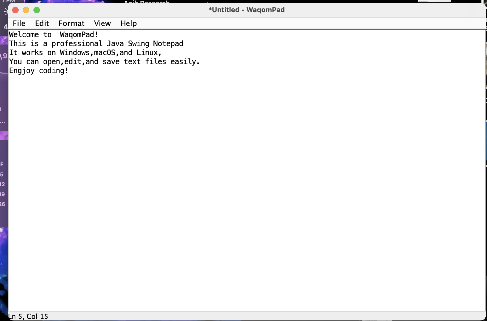

# WaqomPad

**WaqomPad** is a professional Java Swing desktop text editor inspired by Windows Notepad.

It is lightweight, native-looking, and works on **Windows, macOS, and Linux**.

## Preview



## App Icon


## Features

- Native OS title bar
- No duplicate custom window buttons
- Java Swing only
- Open, save, and save as text files
- Multiple windows
- Unsaved changes warning
- Undo and redo
- Cut, copy, paste, delete
- Find and replace
- Go to line
- Time/date insert
- Word wrap
- Font chooser
- Zoom in/out
- Print support
- Status bar with line and column numbers

## Run

```bash
javac src/Waqompad.java
java -cp src Waqompad
```

## Project Structure

```text
WaqomPad/
├── src/
│   └── Waqompad.java
├── assets/
│   └── waqompad_icon.png
├── screenshots/
│   └── main_window.png
├── README.md
└── LICENSE
```

## License

MIT License.
